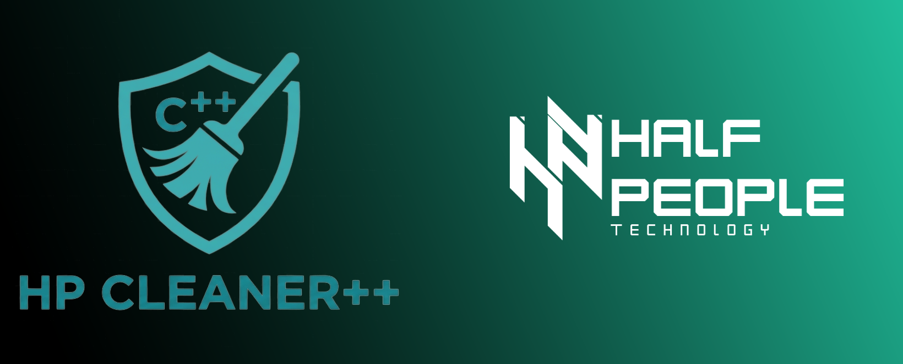

<p align="center">
  <strong>English</strong> &nbsp;|&nbsp; <a href="README.zh-TW.md">繁體中文</a>
</p>
<p align="center">
  
</p>
<p align="center"><sub>Windows system management for gamers and developers</sub></p>

---

# third_party — Vendored dependencies

All external libraries ship **inside this repo**. CMake does **not** download them at configure time.

---

## Package overview

| Folder | Project | Used for | License | Compiled? |
|--------|---------|----------|---------|-----------|
| [`imgui/`](imgui/README.md) | [Dear ImGui](https://github.com/ocornut/imgui) | Entire UI | MIT | Yes (7 `.cpp`) |
| [`implot/`](implot/README.md) | [ImPlot](https://github.com/epezent/implot) | Disk health charts | MIT | Yes (3 `.cpp`) |
| [`json/`](json/README.md) | [nlohmann/json](https://github.com/nlohmann/json) | Settings, i18n JSON, snapshots | MIT | Header-only |
| [`spdlog/`](spdlog/README.md) | [spdlog](https://github.com/gabime/spdlog) | Logging (`HLOG_*`) | MIT | Header-only* |
| [`stb/`](stb/README.md) | [stb](https://github.com/nothings/stb) | `stb_image` texture load | Public domain | Header-only |

\*This build defines `SPDLOG_HEADER_ONLY` — no separate `.lib`.

---

## Include paths (from CMake)

```
third_party/imgui          →  #include <imgui.h>
third_party/implot         →  #include <implot.h>
third_party/json/include   →  #include <nlohmann/json.hpp>
third_party/spdlog/include →  #include <spdlog/spdlog.h>
third_party/stb            →  #include "stb_image.h"
```

---

## Upgrade checklist

When bumping a vendored version:

1. Replace folder contents
2. Rebuild Release — fix any ImGui API breaks
3. Test disk health charts (ImPlot) and log output (spdlog)
4. Update version note in this README if needed

---

## See also

- CMake linkage: [../cmake/README.md](../cmake/README.md)
- 中文說明: [README.zh-TW.md](README.zh-TW.md)
